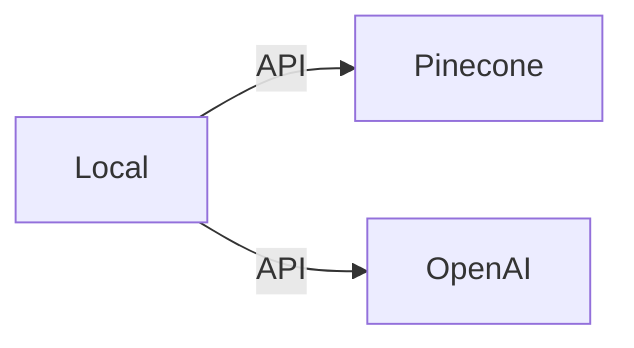

# Poc Embedding Applications  

## Background  
I build this application with jupter notebook to learn how to build applications using GPT and embegging database, which is called as Retrieval Augmented Generation(RAG).  

## What this application can do  
This is Q&A application answering the specific web blog contents.  
A user query about the those web blog contents and then the app answer it.　　

## How to build this application  
1. Data Preparation  
    1. Scrapt the Web Pages  
    We need to gather the data from Web Blog about the details, which Q&A refer it to answer the query.  
    ** Please be careful about the copyright of the web page.  
    The file is [here](scraping/scraping.ipynb)  
    3. (Optional) Format the texts by using ChatGPT.  

2. Build Application  
The script is [here](app/embedding-app.ipynb)  
    1. Import raw data from csv file prepared by step 1.  
    2. Generate the embeddings(vector data) of the raw data by OpenAI API.
    3. Insert the embeddings(vector data) to Pinecone.  
    (Ready for this application to answer the query from a user)  
    4. A user input the query
    5. Generate the embeddings(vector data) of the query by OpenAI API.  
    6. Query to Pinecone with the embeddings(vector data) of the query  
    7. Call OpenAI API by providing the prompt including the raw data as context.    
    
## Solution  Archtecture  
Application Archtecture 

## Reference  
OpenAI  
[OpenAI](https://platform.openai.com/overview)  
[OpenAI Tutorials](https://platform.openai.com/docs/tutorials/web-qa-embeddings)  
[OpenAI Models](https://platform.openai.com/docs/models/gpt-3-5)  
[OpenAI API Reference](https://platform.openai.com/docs/api-reference/chat/create)  
[OpenAI tokenizer](https://platform.openai.com/tokenizer)  
[OpenAI Cookbook Question_answering_using_embeddings.ipynb](https://github.com/openai/openai-cookbook/blob/main/examples/Question_answering_using_embeddings.ipynb)  
[OpenAI Cookbook vector_databases pinecone](https://github.com/openai/openai-cookbook/tree/main/examples/vector_databases/pinecone)  

Vector Database Pinecone  
[Pinecone](https://www.pinecone.io/)  
[What is a Vector Database & How Does it Work? Use Cases + Examples](https://www.pinecone.io/learn/vector-database/)  
[The Missing WHERE Clause in Vector Search](https://www.pinecone.io/learn/vector-search-filtering/)  
[Pinecone Docs](https://docs.pinecone.io/docs/query-data)  
